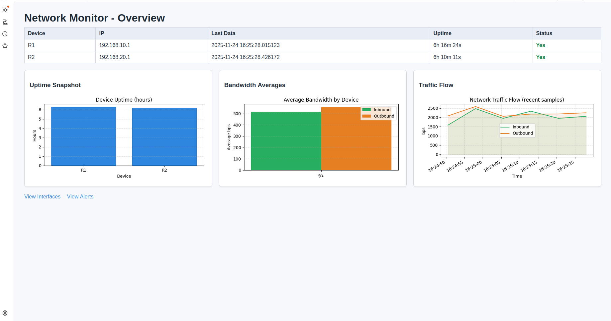
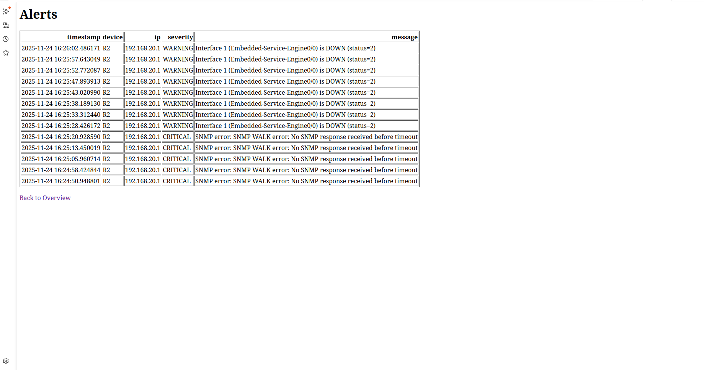
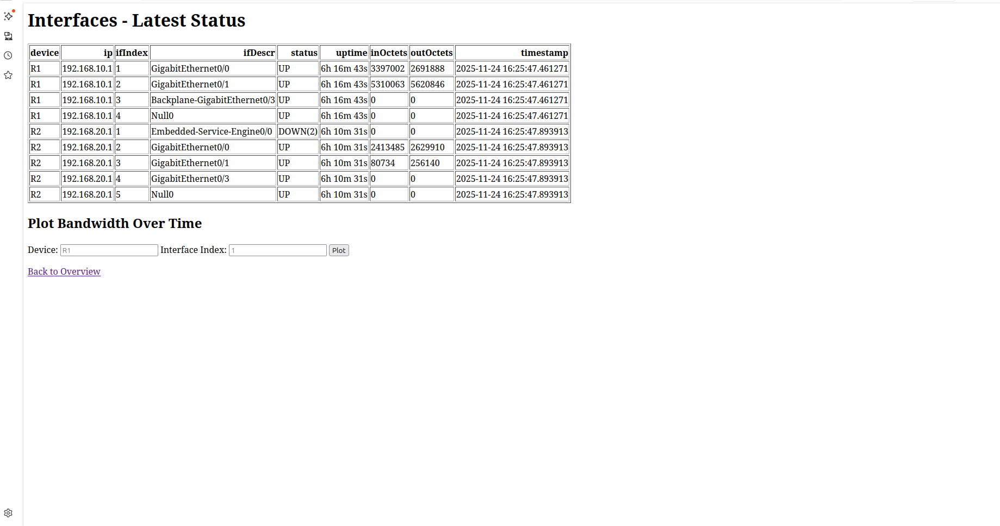

# **Network Monitoring Tool**
This is a Proof of Concept (PoC) Network Monitoring Tool to monitor network devices (specifically Cisco routers 2901).

 
 

# What does this tool have:


It has a dashboard that shows what are the connected routers, their IPs, status and uptime. It visualize the uptime of routers, bandwidth of each router (inbound & outbound).


It has an Alert page where shows if there are some alerts such as disconnection of a router


It has an Interfaces page where it shows info about each interface inside each router such as status, inbound octets (bytes) and outbound octets (bytes)


# **Features**
1. Polls the data from the routers based on the IP address every 4 seconds

2. Shows the uptime and status (Up or down) for each router

3. In the interfaces route, you can see each interface inside each router with some data such as inbound traffic in octets(bytes), outbound traffic in octets (bytes), timestamps of each poll.

4. The status will change if the 2 consecutive polls were unsuccessful to No which means it's down

5. You can see the alerts in alerts route, which will print the device that have alerts and what type of alerts it have.


# How to setup

#### 1. Setup the virtual python env:

Use the python 3.11 since pysnmp is not available in later versions:

```bash
python3.11 -m venv venv
source venv/bin/activate
```

if you have not installed the python 3.11, it won't work correctly.


#### 2. Install the required pacakegs:

Use the requirements file to install the required libraries

```bash
pip install -r requirements.txt
```

#### 3. Configure the devices you want to monitor (Cisco routers 2901) and their IPs, the polling interval, and the name of files inside config.py

for the devices, add devices similar to the given example in config.py

#### 4. Run the codes:

Run collector.py in separate terminal and then run app.py and access the web UI using https://localhost:5000
```bash
python collector.py
# in a separate terminal
python app.py
```

Enjoy!
